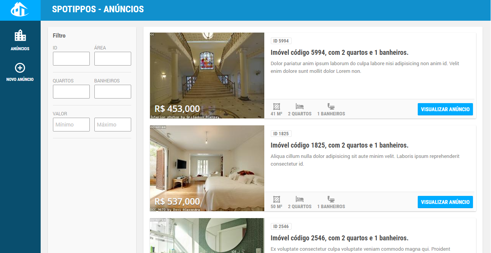

# Spotippos Anúncios
> Aplicativo web que te ajuda a encontrar o imóvel dos seus sonhos em Spotippos.

*Spotippos Anúncios* lista dinamicamente todos os anúncios de imóveis de Spotippos. Com filtros que o ajudarão a encontrar o imóvel dos seus sonhos em Spotippos. 

Você poderá utilizá-lo quando estiver em casa, no seu computador pessoal, ou na rua, em seu dispositivo móvel.



##### Telas
[Tela inicial - Desktop](docs/main-screen_desktop.png) | [Tela inicial - Mobile](docs/main-screen_mobile.png) | [Tela inicial - Tablet](docs/main-screen_tablet.png)

## Instalação
Para a instalação você vai precisar do [Node.js](https://nodejs.org/en/) e [Ruby](https://www.ruby-lang.org/pt/) instalados em sua máquina. Caso ainda não tenha, instale-os agora.

Após a instalação de ambos, abra um prompt de comando (`cmd` no windows) e digite:

```sh
git clone https://bitbucket.org/renato_rodrigues/vivareal-spotippos.git
cd vivareal-spotippos
npm install
npm run server
```

## Uso
Após a instalação, abra o endereço http://localhost:8000 em seu navegador.

Além da listagem inicial, você poderá utilizar os 6 critérios disponíveis na barra lateral para refinar ainda mais a busca pelo seu imóvel ideal em Spotippos.

Sempre que precisar utilizar novamente roda apenas `npm run server` e abra http://localhost:8000 no navegador.

## Opções para desenvolvedores

Os arquivos fonte do projeto estão localizados na pasta *./app* estão organizados em uma estrutura que permite visualizar o resultado do desenvolvimento sem a necessidade de gerar um build a cada atualização. Para isto o `grunt` está configurado para gerar os assets na mesma pasta onde o servidor de DEV serve na porta 8080. 

Os testes automatizados por padrão rodam no PhantomJS, mas existe a opção de rodá-los também no Google Chrome.


##### Utilização

```sh
git clone https://bitbucket.org/renato_rodrigues/vivareal-spotippos.git
cd vivareal-spotippos
npm install
npm run server-dev
```
e para gerar os assets automaticamente, em outra janela digite

```sh
grunt watch
```

##### Testes automatizados
Arquivos ficam localizados em *./test*

PhantomJS (padrão)
```sh
npm run test
```
PhantomJS, execução única
```sh
npm run test-single-run
```
Google Chrome
```sh
npm run test-chrome
```

##### Build
Assets de produção são gerados em *./dist*

```sh
grunt build
```

##### Servidores locais
Pasta *./app* com artefatos de desenvolvimento (porta 8080)
```sh
npm run server-dev
```

Pasta *./dist* com artefatos de produção (porta 8000)
```sh
npm run server
```

## Histórico de lançamentos

* 1.1.0 _[09/06/2016]_
    * Tela de detalhe de imóveis
    * Mapa da localização do imóvel em Spotippos na tela de detalhe
* 1.0.0 _[07/06/2016]_
    * Versão inicial

## Roadmap
* 2.0.0
    * Layout mobile first
* 1.2.0
    * Filtro por províncias na barra lateral
* ~~1.1.0~~
    * ~~Tela de detalhe de imóveis~~
    * ~~Mapa da localização do imóvel em Spotippos na tela de detalhe~~
* ~~1.0.0~~ 
    * ~~Versão inicial~~

## Contato

Renato Rodrigues – [about.me/renato.rodrigues](https://about.me/renato.rodrigues)

Distribuído sob a licença MIT. Veja `LICENSE` para mais informações.

[https://bitbucket.org/renato_rodrigues/](https://bitbucket.org/renato_rodrigues/)
